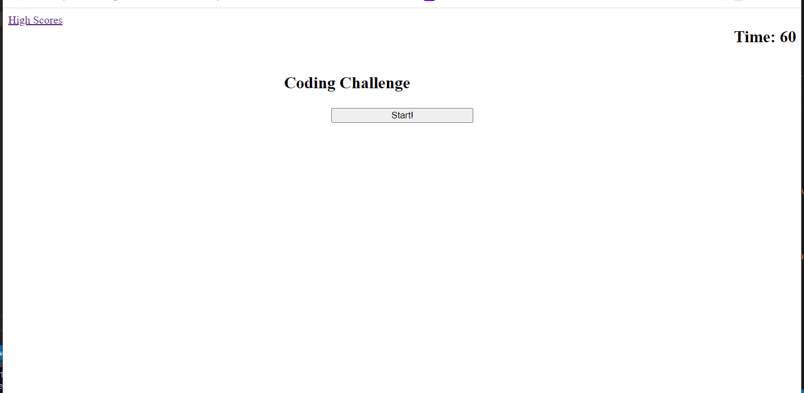
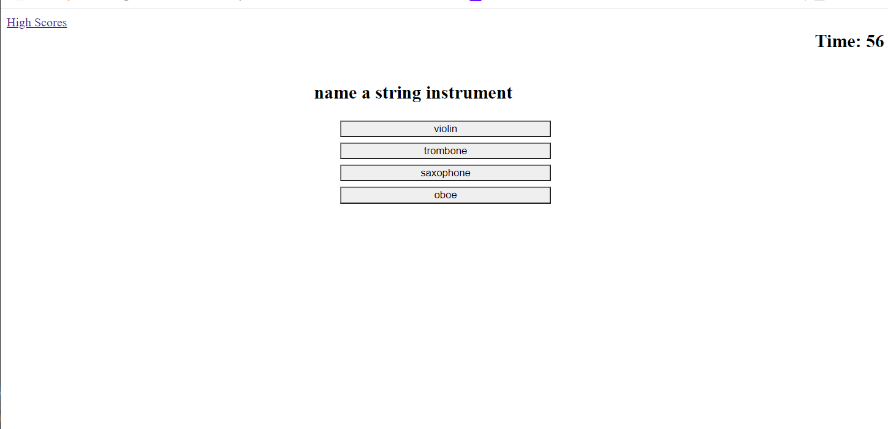

# quiz-game-challenge

Deployment: https://eksem95.github.io/quiz-game-challenge/

This application is a quiz game. The users presses the start button and has 60 seconds to answer all the questions. The user will be told whether or not they are correct. Each wrong answer will subtract time. Your time at the end is your score. At the end of the game you will see the high scores.
 
 